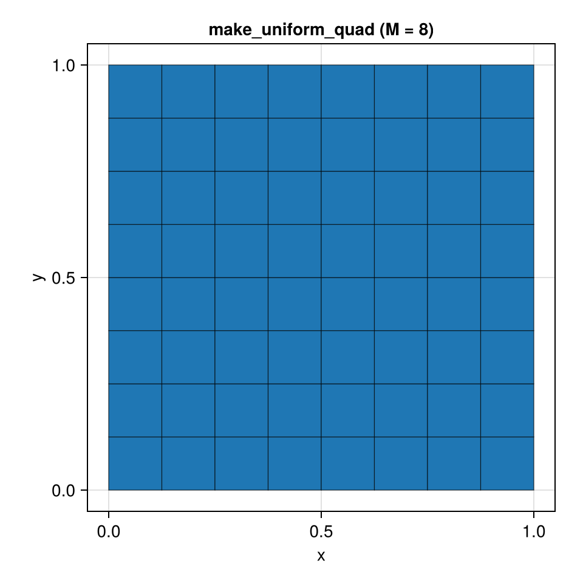
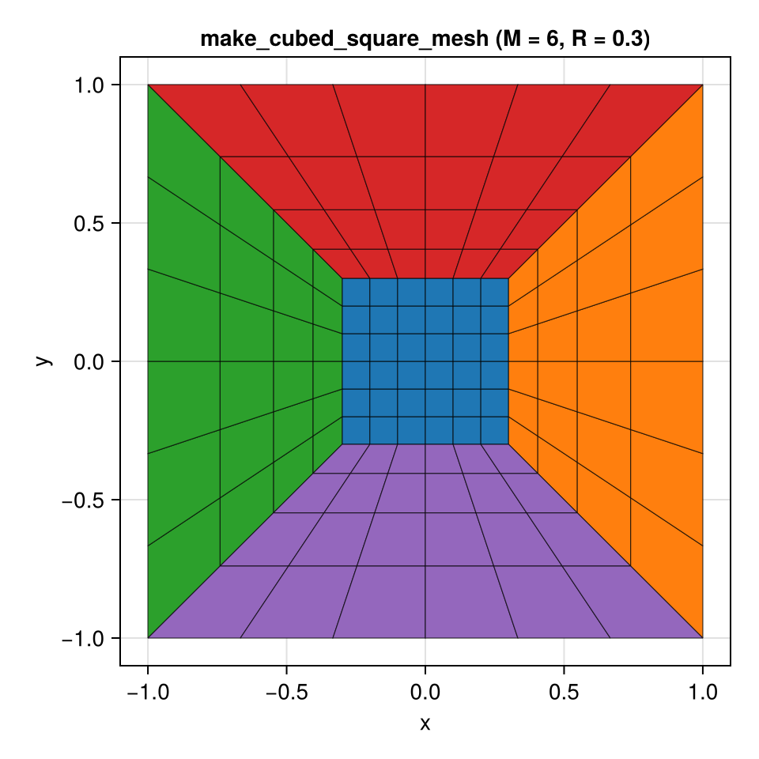
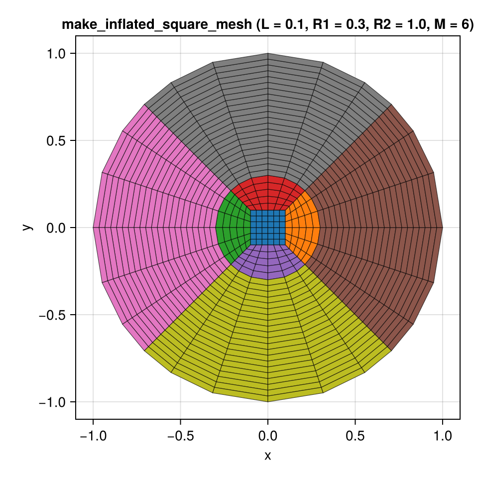

# HexMeshes.jl

Conforming meshes in in 1, 2, and 3 dimensions. The mesh cells are
hexahedral (distorted cubes) in 3d and quadrilateral (distorted
squares) in 2d. "Conforming" means that the cells' faces match up
nicely.

## Details

This package provides functions to construct meshes from skeletons. It
provides data structures store the topology and geometry of the meshes
as well the connectivity of the cell faces. These data structures are
optimized for CPUs, with the intent that mesh cells can be
independently processed by a GPU.

There exist no good open-source packages that create unstructured
hexahedral meshes from scratch. (This is different from simplicial
meshes, where there are known algorithms to create high-quality meshes
from scratch, e.g. via a Delaunay triangulation.) Consequently, the
meshes provided here are created by refining a user-defined *skeleton
mesh*. Currently supported mesh types are
- cube (trivial)
- cubed cube
- inflated cube
and their 2d equivalents.

## 2D mesh examples

### Uniform quad mesh

### Cubed square mesh

### Inflated square mesh

